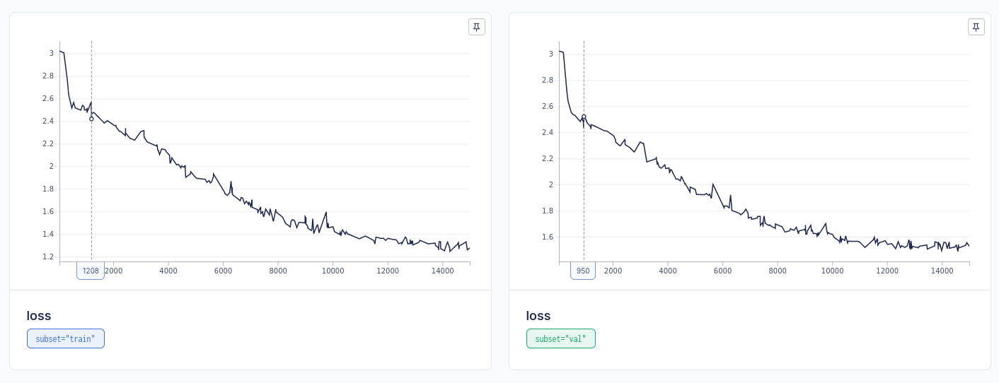

# nanogpt-haiku

Simple and functional implementation of a mini-language model with a non-vanilla Transformer implemented from scratch using the Haiku library from Deepmind.

The implementation is based on Karpathy's lecture on Transformers (he chose PyTorch instead of Jax for his implementation).
- https://github.com/karpathy/ng-video-lecture
- https://www.youtube.com/watch?v=kCc8FmEb1nY&t=6035s

Haiku uses Jax as the underlying library, the new functional-style autograd library from Google, which is based on XLA, a new Google JIT compiler.

Unlike PyTorch, with Jax, the function implementing the model is a pure so you can have explicit control over the model's state by passing and returning the parameters and other state variables to the function that implements the model.

# Trained to generate Old Castilian Spanish
The model was trained to generate Old Castilian Spanish Language (OCSL), using as dataset the "Exemplary Novels" by Miguel de Cervantes, published in 1613. You can find the complete dataset used in the file `novelas_ejemplares.txt` in this repo.

# Installation
Just clone the repo, create a virtual env, upgrade pip, install CPU or CUDA Jax 0.4.7 or the version according to your installed CUDA installation (see: https://github.com/google/jax#installation) and install the requirements.txt file.

    - git clone https://github.com/luis-gnz11/nanogpt-haiku
    - python3 -m venv venv; source venv/bin/activate
    - pip install pip --upgrade
    - pip install --upgrade "jax[cuda11_pip]" -f https://storage.googleapis.com/jax-releases/jax_cuda_releases.html  # if using CUDA11 (check the jax site for other install options)
    - pip install --upgrade "jax[cpu]==0.4.7"  # if using CPU
    - pip install -r requirements.txt

#  ML Ops
The Aim library is used in the code to manage different experiments info (see: https://github.com/aimhubio/aim).

# Training
1. Change the `CONFIG` params in `train.py` and the model hyperparameters in `HPARAMS` in the `transformer.py` file.
2. Train with: `python train.py`

# Pretrained params
You can find pretrained params in the file `params/params/params.c1069c8d186b4b4e8852ebfe.pkl.min_val.pkl`. This is the file loaded by default by `eval.py`. 

These params were generated with the default `CONFIG` and `HPARAMS` variables found in the `train.py` and `eval.py` files. The model was trained for two hours on an Nvidia 3060 GPU achieving a minimum cross entropy loss error of 1.29 for the training dataset and 1.44 for the validation dataset:

# Evaluation
Simply run `python generate.py`.

This will generate text in the OCSL style, starting from the sentence in the file eval_context.txt used as the initial context. You can modify this file or the `CONFIG` variable in `eval.py` to get other results.

The initial pseudorandom seed is based on the current UNIX epoch, so we get the different text with every run. Fix its value in the `CONFIG` variable to get deterministic text results.

Given the relatively small Transformer model implemented, and also the very small dataset used, a single small novel (~18000 lines and ~1 million characters), 5.4 million trainable params, and within two hours of training on an Nvidia 3070, the network has been able to learn and generate text, although without any apparent meaning, in the style of the OCSL.

For example, starting from the initial sentence as context:

> No hay camino tan llano que no tenga algún tropezón o barranco 
> en otras casas cuecen habas, y en la mía, a calderadas 
> más acomp 

The model generates:

> No hay camino tan llano que no tenga algún tropezón o barranco 
> en otras casas cuecen habas, y en la mía, a calderadas 
>  más acompañeraba del duque, la cólera una persupa que á los armados que habeis acajegado 
> su vuesa merced, por las dueñas, quitarse que tomó olvíno de sus padre á ser sus mis sena 
> pan muchas nos mil bueno supiro, 
> que son los turcosa cosase son de mi mostraba quiero, y plata, sin 
> ó á un desposar el questras que se fuese la siguera, á Babeis á quien siete sata señor 
> á sargocer que siempre; eranuncon el eran adónde y deudar limpicia, tuviéronsa 
> trueco, esplánica hacer gestil: dieron los dos britan manera casa, porque 
> estamparable toda la ciudado que habia hicería jugaro, hizo sin obligar las 
> dosatino: á sus su amadó prometua... 

# Variations of the implementation over the vanilla Transformer
- Pre-normalization. The normalization layer is applied before the transformations, i.e., before the:
  - Multihead self attention block
  - Cross attention block
  - FF block
  - There is also one final normalization before the final linear layer
- Including dropout:
  - Added a dropout as a final layer of the feed forward transformation, just before the residual connection
  - At the end of the multi-head self attention
  - Inside the multi-head masked self attention: we can dropout after the softmax, so we can rqndomly prevent some of the nodes/token from "communicating"
- The encoder is implemented but is optional (not neccesary for our mini language model).

# References
- https://arxiv.org/abs/1706.03762
- http://nlp.seas.harvard.edu/annotated-transformer/
- https://kikaben.com/transformers-coding-details/
- https://github.com/karpathy/ng-video-lecture
